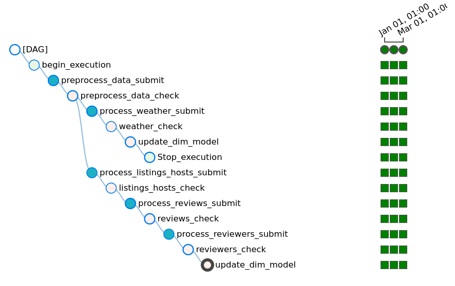

# Airbnb ETL pipeline: Spark(Scala) in Databricks & Airflow

Are there more positive or negative reviews of Airbnb stays? Are reviews more negative when weather is bad? Are all reviews in English? Are there hosts with listings in multiple cities? How many guests visited more than one city? ...

Goal of this project is to prepare data that can answer all the questions above and many more. Raw data from several sources are transformed using Apache Spark, enhanced by natural language processing algorithms and stored in Azure Blob Storage for further analytics. Apache Airflow is used to schedule and monitor the pipeline execution.

This project is an extension to [Airbnb ETL pipeline: Spark on EMR, Redshift & Airflow](https://github.com/jirfig/Airbnb-ETL-pipeline-Spark-on-EMR-Redshift-Airflow) project, which uses different tools to accomplish the same goal.

## Table of contents

- [Dimensional model](#dimensional-model)
- [Source data](#source-data)
- [ETL pipeline](#etl-pipeline)
- [Exploring the data](#exploring-the-data)


## Dimensional model
To better understand the ETL pipeline, lets describe the final outcome of the pipeline first - the dimensional model that can be queried in e.g. Databricks SQL.

The model holds data about Airbnb listings, including their name, location, description. It holds information about hosts offering stays. Hosts can have multiple listings. The model holds reviews of Airbnb stays. There are multiple reviews per reviewer and each listing can receive multiple reviews. The model also contains weather data, daily rain and temperature measurements. Reviews and weather data are available only for selected cities: Paris, London, Amsterdam and Berlin. 

The model comprises five tables: fact table *reviews* and dimensional tables *reviewers*, *listings*, *hosts* and *weather*.

[Data dictionary](/docs/data_dictionary.xlsx) provides descriptions of the data, it is mostly a copy from [Inside Airbnb's data dictionary](https://docs.google.com/spreadsheets/d/1iWCNJcSutYqpULSQHlNyGInUvHg2BoUGoNRIGa6Szc4/edit#gid=360684855) that comes with the source data.

Statistics (unique records):
- listings: 630728 records
- reviews: 3313766 records
- reviewers: 2788446 records
- hosts: 449889 records
- weather: 17888 records

Below is a summary of the most interesting columns:

|Reviews |Reviewers |Listings |Hosts | Weather|
|--|--|--|--|--|
|review_id	|			| 		|	 	| 		|	
|reviewer_id	|	reviewer_id	|  		|  		|  		|
|listing_id	|			|listing_id	|  		| 		|
|host_id	|			|host_id	| host_id	| 		|
|weather_id	|			|		| 		| weather_id	|
|--|--|--|--|--|
|date		|			|		| 		|date		|
|reviewer_name	|	reviewer_name	|		| 		| 		|
|		| 			|city		|		|city		|
|		| 			|last_scraped	|last_scraped	|		|
|--|--|--|--|--|
|sentiment	|	languages_spoken|first_review	|host_name	|temperature	|
|comment_language|			|longitude	|host_about	|rain		|
|comments	| 			|latitude	|host_location	|		|
|		| 			|name		|host_url	|		|
|		|	 		|picture_url	|host_picture_url|		|
|		| 			|price		|		|		|
|		| 			|property_type	|		|		|
|		| 			|room_type	|		|		|
|		| 			|license	|		|		|
|		| 			|listing_url	|		|		|
|		| 			|description	|		|		|


## Source data
There are 3 sources of data:
- Inside Airbnb's listings and reviews data, scraped monthly [Download here.](http://insideairbnb.com/get-the-data.htm)
	- period: January, February and March 2021
	- cities: Amsterdam, Paris, London, Berlin
	- format: csv
- Airbnb listings data downloaded from opendatasoft, it contains ~490k unique listings from several dozen cities globally. Format: csv. [Download here.](https://public.opendatasoft.com/explore/dataset/airbnb-listings)
- Weather data, daily mean temperature and daily rainfall from ecadu.eu. Format: txt. [Download here.](https://www.ecad.eu)

My usage of Inside Airbnb's data does not align perfectly with their mission, I can only say thank you and spread the word, check them out at [http://insideairbnb.com/](http://insideairbnb.com/)

Total size of the source data is 5.8 GB, total number of records ~14.7 million. However, many of the records are duplicates.

Use [get_original_data.ipynb](get_original_data.ipynb) to download the data.

## ETL pipeline

ETL comprises two parts
- Part I: preprocess raw data into parquet files
- Part II: create or update dimensional model using the preprocessed data

In Part I raw data stored in csv and txt files are read using Apache Spark and with minimal transformation saved into parquet files, columnar format more suitable for fast reads. Minimal transformations include dropping columns, removing multiline headers from txt files and extracting city name from filepath of the data.


In Part II Spark reads preprocessed parquet files and transforms them into the final dimensional model tables in csv format. Transformations performed include: joining tables using join and union operations, filtering using window functions, and dropping duplicates. Natural language processing models from Spark-NLP library is used for language detection of Airbnb reviews and sentiment analysis is performed on the english subset of the comments.


### Apache Airflow
The entire ETL is orchestrated by Apache Airflow

Source data of Airbnb listings and reviews are available in packages updated every month. The ETL is scheduled to run every month, pickup data from folder labeled by relevant month and use it to create dimensional model either from scratch if none exists or update existing one. The source data include January, February and March 2021 data and are run with backfill.

The ETL is designed robustly and if new data in the same format are provided then it can continue updating the dimensional model *forever*.

Here are some of the most interesting features used:
- backfill - processing data in batches labeled by execution date
- parallel tasks
- DatabricksSubmitRunOperator to run Spark Jar jobs in Databricks




### Spark in Databricks
The ETL is executed automatically by Airflow, but it can also be run interactively in notebooks, in both cases on Azure Databricks.

Databricks notebook [etl_notebooks/Airbnb-etl-notebook.scala](etl_notebooks/Airbnb-etl-notebook.scala) can be uploaded to Databricks and directly executed cell-by-cell.
							
Airflow uses DatabricksSubmitRunOperator to create job clusters. Each step is executed by calling a Scala class in compiled jar.

 that contains identical code as implemented in [etl_notebooks/Airbnb-etl-notebook.scala](etl_notebooks/Airbnb-etl-notebook.scala). Source code is stored in  however it is split into five files stored in [apps](/apps) folder.
Each .py file is run using spark-submit with execution date passed as argument to allow updating the dimensional model on monthly basis, exactly the frequency source data are available in.

```
process_reviews_submit = DatabricksSubmitRunOperator(
    task_id = 'process_reviews_submit',
    databricks_conn_id = 'databricks_default',
    spark_jar_task = {'main_class_name': 'com.jirfig.process_reviews',
                      'parameters': ['{{ execution_date.strftime("%Y-%m") }}',dim_model_container,dim_model_container_new,"dbfs:/FileStore/config/prj_cfg.csv"]},
    new_cluster = cluster_specs,
    libraries=[{'jar': jar_path},
               {"maven": {"coordinates": "com.johnsnowlabs.nlp:spark-nlp_2.12:3.2.2"}}], 
    dag=dag
)

```


Example runtime:
- Creating dimensional model from scratch using January 2021 monthly data.
- Master: 1x Standard_DS3_v2
- Worker: 1-9x Standard_DS3_v2, autoscaled by databricks
- Configuration: managed by databricks

| Step| Runtime|
|--|--|
|preprocess_data		|6 min|	
|process_listings_hosts		|2 min|	
|process_weather_submit		|2 min	|
|process_reviews_submit		|90 min	|
|process_reviewers_submit	|2 min	|


## How to run the project
1. Download source data using [get_original_data.ipynb]/(get_original_data.ipynb)
2. Create Azure storage account and get a connection string.
3. Edit "config/prj.cfg_template" to insert Azure storage account connection string and save it as "config/prj.cfg"
4. Create new containers in Azure Blob Storage and upload raw data using [file_operations_azure_blob_storage.ipynb]/(file_operations_azure_blob_storage.ipynb)

Local jupyter notebooks are tested with Python 3.8.5 and azure-storage-blob 12.8.1.

There are two ways how to run the ETL, using databricks notebooks and using airflow.

### 1. Databricks notebook
1. From Azure storage account get an access key and connection string

2. Create Secret Scope and put two secrets in: azure storage account access key and connection string. To do that use e.g. Databricks CLI in local terminal. This requires Databricks access token to setup. The secrets are used to connect Azure blob storage to databricks: 
```
dbutils.secrets.get(scope = <scope_name>, key = <key>)
```

3. Create All-purpose cluster and install the following libraries:
- com.johnsnowlabs.nlp:spark-nlp_2.12:3.2.2 (necessary to run language detection and sentiment analysis)
- azure-storage-blob (necessary to move files between Azure containers)

4. Import the Scala source notebooks to Databricks and run interactively:
- [etl_notebooks/Airbnb-etl-notebook.scala](etl_notebooks/Airbnb-etl-notebook.scala)
- [etl_notebooks/Airbnb-test-notebook.scala](etl_notebooks/Airbnb-test-notebook.scala)


### 2. Airflow
Works with Python 3.8.5, Airflow 2.1.3 with two provider packages: databricks and microsoft-azure. Airflow uses LocalExecutor with Postgres 9.6. 

1. Edit "config/prj_cfg.csv_template" to insert Azure storage account and key and upload it as "prj_cfg.csv" to "dbfs:/FileStore/config/prj_cfg.csv"
2. Compile application jar or download it from releases and upload it to "dbfs:/FileStore/jars/airbnb-etl_2.12-1.0.jar"
3. Copy the [airflow/dags/airbnb-databricks.py](airflow/dags/airbnb-databricks.py) to your $AIRFLOW_HOME/dags/ folder. 
4. Run airflow webserver and scheduler

## Exploring the data with Databricks SQL

Note: Main focus of this project is the ETL pipeline toolchain. NLP algorithms such as language detection and sentiment analysis are included for demonstration only. Language detection appears to have worked quite well, but it is far from perfect. Quality of sentiment analysis is poor at best. Do not make any conclusions from the query results of the final model. 

See the queries in [docs/dashboard.png](docs/dashboard.png)

[docs/review_count.png](docs/review_count.png)

Are there more positive or negative reviews of Airbnb stays?
- About 97% of reviews were detected positive, while about 3% negative.

Are review comments more negative when weather is bad? 
- The results suggest that weather does not strongly influence sentiment of the comments. Actually the average temperature was a bit higher and rainfall lower when comments are negative. If there is any relationship between weather and sentiment its hidden deeper in the data.

Are all reviews in English?
- About 72% of comments are in English, followed by French 13% and German 4.6%.

Are there hosts with listings in multiple cities?
- There is a host with listings in 135 cities and many other hosts with listings in dozens of cities.

How many guests visited more than one city?
Looking at Amsterdam, Paris, London and Berlin, most guest stayed with Airbnb in just one of the cities, just 319 visited them all.

|cities_visited |	count|
|--|--|
|4 | 	319|
|3 |	7525|
|2 |	132009|
|1 |	2648593|


  
